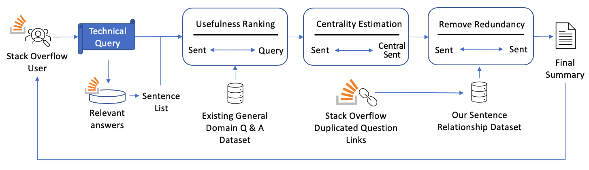
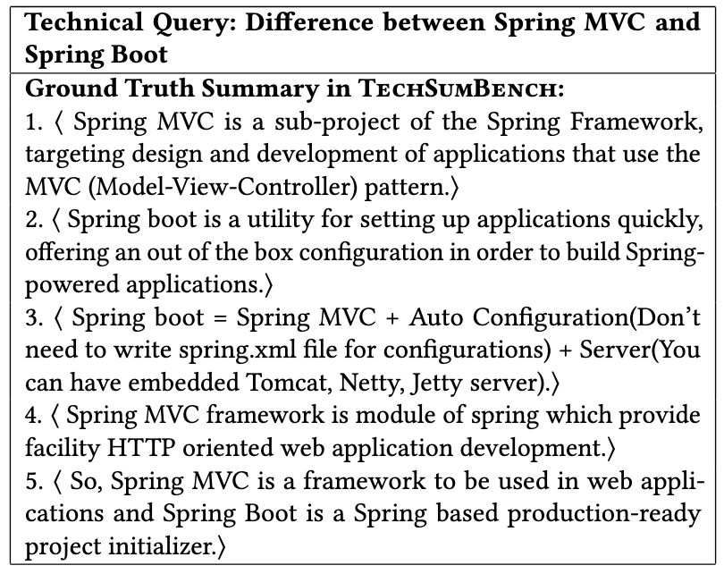
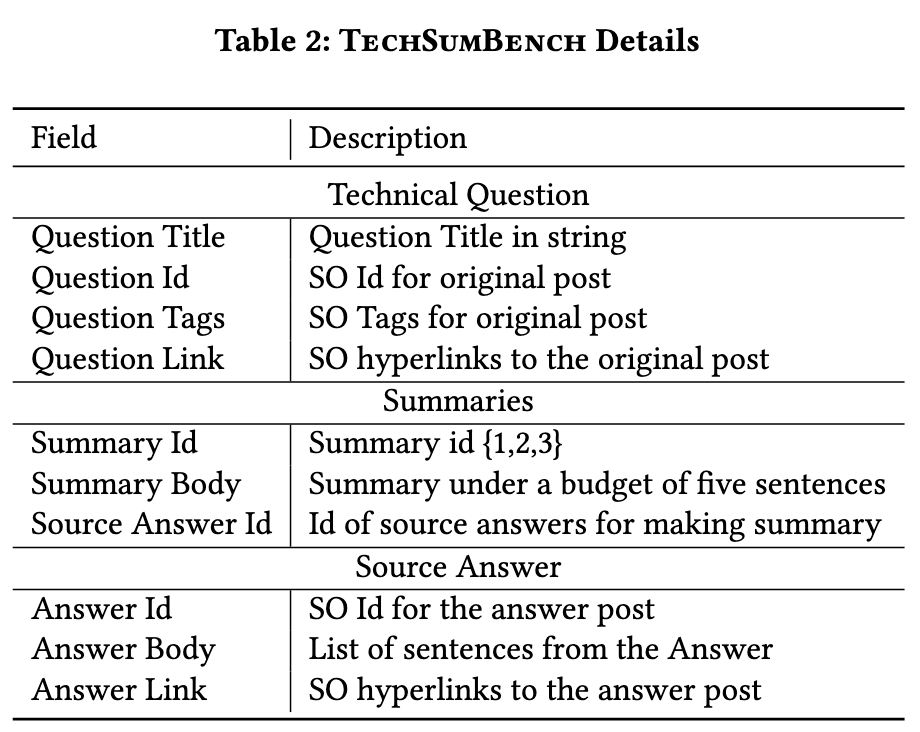

# Answer Summarization for Technical Queries: Benchmark and New Approach

This repository contains the code, pre-trained models, and Stack Overflow summarization benchmark for our paper: "Answer Summarization for Technical Queries: Benchmark and New Approach" [\[pdf\]](presentation/ase22-162.pdf).

Our tool is also available at http://techsumbot.com (please kindly refers to the [guideline](tool_src/readme.md) to deploy this web-service on your local machine).

# Quick Link

+ [Overview](#overview)
+ [Benchmark](#benchmark)
+ [TechSumBot](#getting-started-with-techsumbot)
+ [Baseline](#baseline)

# Overview

We construct the first summarization benchmark named TechSumBench for answer summarization of technical queries in SQA sites.
We also propose TechSumBot, a novel query-focused answer summarization approach with three modules to automatically generate answer summaries for techinal queries.
The following figure is an illustration of our approach's pipeline.


# Benchmark

## Overview

We provide 111 query-summary pairs in TechSumBench.
Specifically, there are 37 technical questions in TechSumBench, each of which corresponds to three ground truth answer summaries that are independently labeled by three annotators. Each summary contains five sentences extracted from corresponding 10-15 relevant answers. The following figures are the example ground truth summaries and the data field contained in our benchmark.

<center>
<figure>
<!--  
 -->


</figure>
</center>

## Query & Summaries

The input query and related answers are contained in the folder:

```
dataset/input/
```

The ground truth summaries are contained in the folder:

```
dataset/gold/
```

Each summary is assigned with a unique identifier based on its annotator (i.e., 1,2,3) and the query number (i.e., 0-36). For example, the summary that is produced by the first annotatr and answered the fourth query is assigned with the identifier ``#01_04``.

## Mid-result

We also provide the labeling result of the first phase, in which 2014 answer sentences are labeled as useful and non-useful to the specific query by three independent annotators.
The result of phase 1 are contained in the folder:

```
dataset/phase_1_result/
```

## Guideline

We also release our guidelines for both phase I and phase II as following:

```
dataset/guideline
```

# Getting Started with TechSumBot

## Data Preparation

We provide our proposed answer summarzation tool TechSumBot. To use this tool, firstly you're required to train the transformer model for the module I. You can also fine-tune the model with your own data. Please refer to our guideline in the ``src/_1_module``

```
src/model/module_1/readme.md
```

Then you prepare the domain-specific sentence representation model.

For the detailed data preparing, training, and fine-tuning process, please kindly read the readme file in the

```
src/_2_module/readme.md
```

## Environment Setting

Then please create a python vitural environment for running TechSumBot by using the configuration file:

```
packages.txt 
```

## Rouge Setting

To set the ROUGE evaluation, please follow [this instruction](https://stackoverflow.com/a/57686103/10143020).

## Running the pipeline

Finally, please do the following to run TechSumBot:

```
cd src/
python end2end.py
```

The generated summaries would be stored in the following:

```
src/result
```

Also, you can use

```
src/evaluate.py
```

to evaluate the performance of TechSumBot in terms of ROUGE score.

# Baseline

We provide the code and readme files for each baseline in the folder:

```
baseline/
```

Besides, we give the result of each baseline (generated summaries) in the folder:

```
system_result/
```

So that you can directly use the result for quick evaluation.
